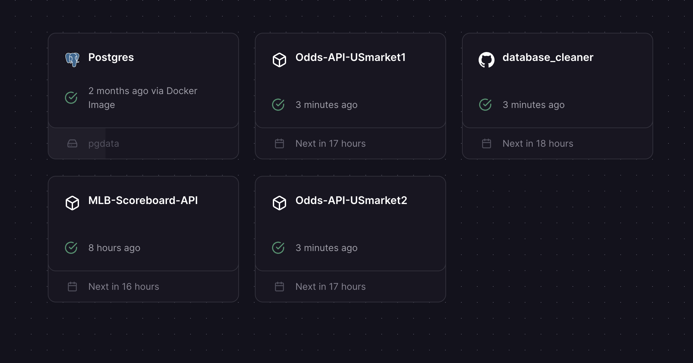
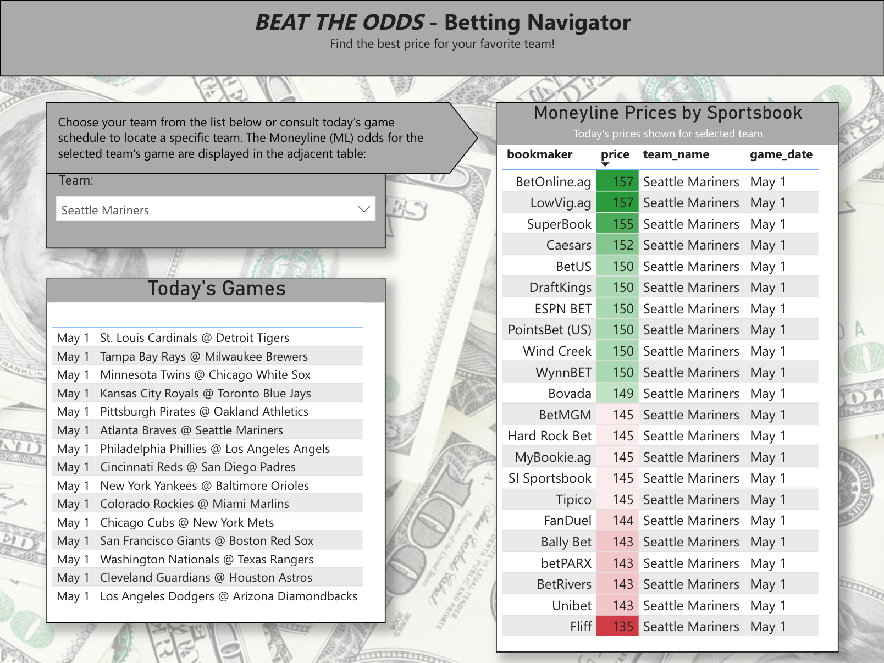
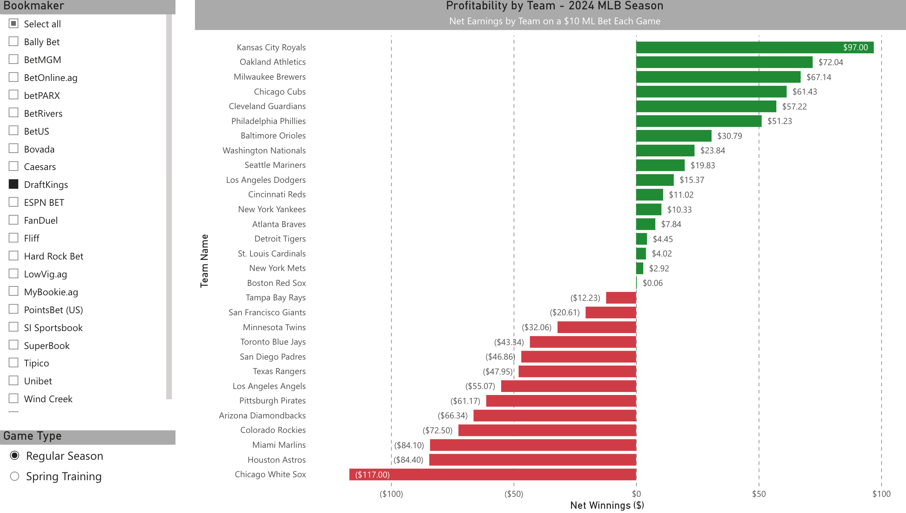
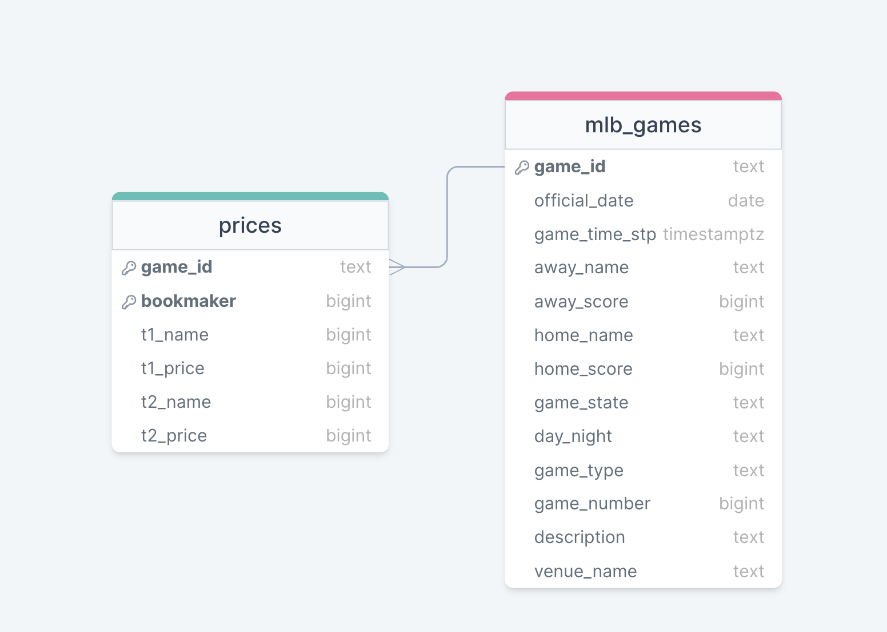

# MLB Sportsbetting ETL Project

*_***UPDATE: As of May 1st 2024, my subscription to PowerBI and the cloud platform Railway hosting my data pipeline have ended with the finishing of the class. The dashboard and data in this repository have MLB Preseason/Regular Season game results and sportbetting odds from March 2nd - May 1st_*

This repository contains my final project for my Graduate Data Engineering class at Willamette University. The end result was a Power BI dashboard connected to my live data source which was a data pipeline serving sportsbetting data from over 20 different US sportsbooks and daily MLB game results. The pipeline gave the ability to observe live MLB moneyline odds for daily games from over 20 different US sportsbooks, as well as the ability to analyze profitability of those odds with attatched game results data.

This project showcases my comprehensive ability to carry out an ETL process:

- Extracting data using a Docker Image to pull raw JSONB data from 5 diffferent API endpoints into a cloud hosted PostgreSQL database.
- Transforming that data regularly in the cloud using a Docker Container that uses psql to run SQL code into a database in third normal form (3NF).
- Loading that data into an informative Power BI report that isi able to communicate key insights of MLB sportsbetting odds and team profitability.

View the report Power BI report [here](https://app.powerbi.com/groups/16ae97bc-f021-4246-b11e-638b2ab3cb6a/reports/014bc0ce-8d53-4aa7-b3f9-4febf1e88f1a/ReportSection4636aaa8c019734a14c2?ctid=46bc6c40-368d-4a20-9b1b-c1842f786542&experience=power-bi), or if my school organization's privacy settings do not allow viewing, see images of the dashboard in the [About](#about) section.

## Table of Contents

- [About](#about)
- [Contents](#contents)
- [Skills](#skills)
- [License](#license)
- [Contact](#contact)

## About

#### The Problem

A goal of mine has always been to complete a data science project relating to sportsbetting as the industry is massive and sportsbooks carry out extensive data analysis and machine learning to set odds. Datasets relating to sportsbetting or odds prices are not widely availible on the usual platforms such as Kaggle or Machine Learning Repositories which I had not pursued a project relating to this beforehand.

#### The Goal

The goal of this project was to leverage my skills in postgreSQL, Bash, Docker, and Power BI to extract, transform, and load sportsbetting data from a variety of API endpoints in order to compile enough meanigful data to carry out an analysis comparing odds prices accross US sportsboooks while also comparing profitability among different teams.

Work for this project began in March, which meant the only availble sport was MLB preseason which would later in the project switch to the regular season. This lead to the primary focus of the project being on MLB game and sportbetting data. API calls were made daily for live odds of the day's MLB moneyline matchups as well as the game results at the end of the day. The pipeline gave the ability to observe live MLB moneyline odds for daily games from over 20 different US sportsbooks, as well as the ability to analyze profitability of those odds with game results data.

#### The Data Sources

Data was pulled from a total of 5 different API's for this project. Listed below are the API sources and ingestion schedules:

[THE ODDS API](https://the-odds-api.com/) (Reference Website for Odds API’s)

1. API Endpoint for MLB Preseason US Region 1 Odds:
   - This endpoint was live JSON data for MLB preseason moneyline odds prices from US market 1 sportsbooks for daily games.
   - The API call was made at 2:00am PST daily.
  
2. API Endpoint for MLB Preseason US Region 2 Odds:
   - This endpoint was live JSON data for MLB preseason moneyline odds prices from US market 2 sportsbooks for daily games.
   - The API call was made at 2:00am PST daily.
  
After the conclusion of the preseason:
     
3. API Endpoint for MLB Regular Season US Region 1 Odds:
   - This endpoint was live JSON data for MLB regular season moneyline odds prices from US market 1 sportsbooks for daily games.
   - The API call was made at 2:00am PST daily.
     
4. API Endpoint for MLB Regular Season US Region 2 Odds:
   - This endpoint was live JSON data for MLB regular season moneyline odds prices from US market 1 sportsbooks for daily games.
   - The API call was made at 2:00am PST daily.
   
[The MLB's Live Scoreboard API](https://statsapi.mlb.com/ (Reference Website for MLB game scoreboard))

5. API Endpoint for Daily Scoreboard:
   - This endpoint was live JSON data for a daily scoreboard of MLB games.
   - The API call was made at 11:55pm PST daily in order to retrieve the final scores of the daily games.
  
**Data Pipeline Ingestion and Transformation Diagram**

#### The Product

The final product was a Power BI dashboard serving live MLB moneyline odds for daily games from over 20 different US sportsbooks, as well as the ability to analyze profitability of those odds with attatched game results data updating daily.

View the report Power BI report [here](https://app.powerbi.com/groups/16ae97bc-f021-4246-b11e-638b2ab3cb6a/reports/014bc0ce-8d53-4aa7-b3f9-4febf1e88f1a/ReportSection4636aaa8c019734a14c2?ctid=46bc6c40-368d-4a20-9b1b-c1842f786542&experience=power-bi), or if my school organization's privacy settings do not allow viewing, see images below:

###### Daily Odds Prices Dashboard

###### Live Profitability Graphic - Most profitable teams off a $10 ML bet every game

This dashboard gave daily, real-time insights to sportsbettors on the optimal areas for profitablility on moneyline betting for MLB games based on differentials in US sportsbook's odds prices and team performance.

## Contents

In this repository you will see the following files:

**Final Data:**
- mlb_games.csv: MLB Scoreboard game results from March 2nd, 2024 - May 2nd, 2024.
- prices.csv: Moneyline odds prices for every daily game, for each team collected from over 20 different US sportsbooks.
ERD:

**Images:** folder containing supplemental images for the project.

**Docker Container Cleaner:** The files in this folder were previously hosted in a GitHub repo that was called on by my cloud service to make regular transformations to my database. The clean.sql file has SQL script to clean and transform the raw ingested API data into organized and structured tables.

**Presentation Slides:** My final presentation slideshow to communicate my project.

## Skills

**ETL Workflow:**
- Extracting data using a Docker Image to pull raw JSONB data from 5 diffferent API endpoints into a cloud hosted PostgreSQL database.
- Transforming that data regularly in the cloud using a Docker Container that uses psql to run SQL code into a database in third normal form (3NF).
- Loading that data into an informative Power BI report that isi able to communicate key insights of MLB sportsbetting odds and team profitability.

**Data Cleaning/Wrangling:**
- Extensive data cleaning & wrangling performed in order to create meaningful data table able to be analyzed in power BI.

**Power BI:**
- Connected a live data source using an ODBC connector.
- Wrote DAX measures to create important metrics to analyze betting profitability by team.
- Conditional formatting.
- Power Query.
- Matricies & Slicers.

## License

This project is licensed under the MIT License - see the LICENSE file for details.

## Contact

Feel free to reach out to me if you have questions or comments!

